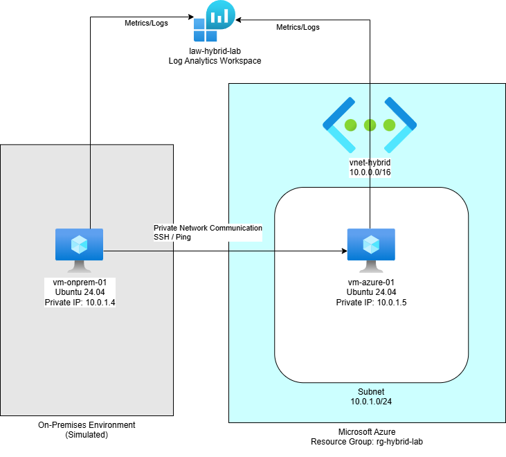
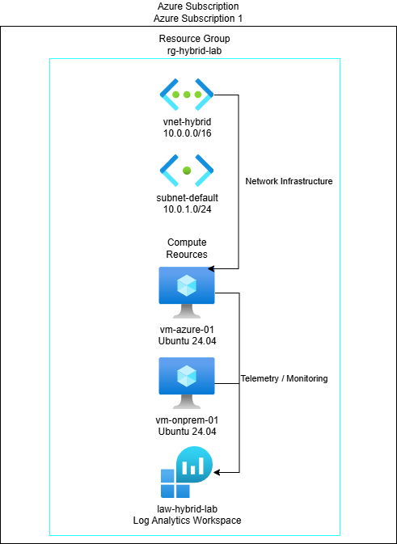
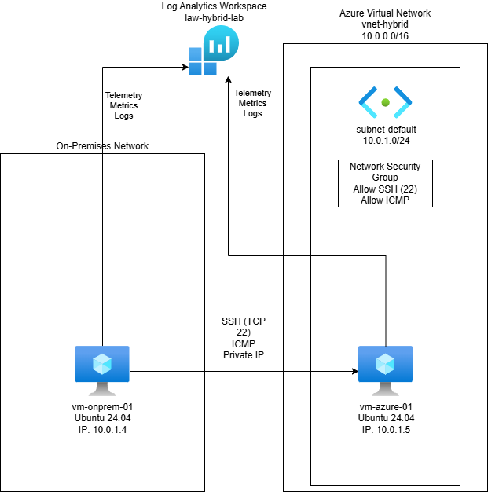

# Azure Hybrid Infrastructure Lab

---

## 📌 Overview

This project demonstrates the deployment of a **hybrid cloud infrastructure using Microsoft Azure**.  
It simulates an on-premises environment connected to Azure resources while implementing networking, monitoring, and hybrid management concepts.

The lab highlights real-world cloud engineering skills including:

- Infrastructure deployment
- Hybrid networking concepts
- Monitoring and observability
- Troubleshooting Azure resource limitations

---

## Table of Contents

- [Overview](#overview)
- [Objectives](#-objectives)
- [Architecture](#architecture-overview)
- [Technologies Used](#️-technologies-used)
- [Deployment Summary](#-deployment-summary)
- [Challenges & Solutions](#️-challenges--solutions)
- [Key Learnings](#-key-learnings)
- [Resume Value](#-resume-value)
- [Future Improvements](#-future-improvements)

---

## 🎯 Objectives

- Deploy and configure Azure infrastructure components
- Simulate hybrid architecture using cloud-based resources
- Enable monitoring and observability
- Understand Azure Arc use cases and limitations
- Demonstrate real-world troubleshooting and adaptability

---

# Architecture Overview

This diagram illustrates the simulated hybrid environment where an on-premises virtual machine communicates with an Azure virtual machine through a virtual network while both systems send telemetry to Azure Monitor.

---

# Azure Resource Deployment

This diagram shows how Azure resources are organized within the subscription and resource group, including networking, compute resources, and monitoring services.

---

# Network Traffic Flow

This diagram demonstrates how network traffic flows between systems, including SSH communication between virtual machines and telemetry sent to the Log Analytics workspace.

---

## ⚙️ Technologies Used

- Microsoft Azure
- Azure Virtual Machines (Linux)
- Azure Virtual Network (VNet)
- Network Security Groups (NSG)
- Azure Monitor
- Log Analytics Workspace
- Azure Arc (conceptual implementation)

---

# 🚀 Deployment Summary

The following steps outline the infrastructure components deployed during this lab.

### 1. Azure Resource Group

Created the resource group:

`rg-hybrid-lab`

to organize all infrastructure resources.

---

### 2. Azure Networking

Configured the Azure networking environment:

- Virtual Network: `10.0.0.0/16`
- Subnet: `10.0.1.0/24`
- Enabled internal VM communication

---

### 3. Azure Virtual Machines

Two virtual machines were deployed:

- `vm-azure-01` – Azure cloud workload
- `vm-onprem-01` – Simulated on-premises system

Both systems run:

Ubuntu 24.04 LTS

Due to regional SKU restrictions, the VMs were deployed using an available **DC-series instance size**.

---

### 4. Azure Hybrid Architecture Simulation

The lab simulates a hybrid environment by deploying two virtual machines within the same Azure network and treating one as an on-premises system.

Connectivity between the machines was verified using private IP communication.

---

### 5. Azure Arc (Conceptual Implementation)

During the lab an attempt was made to onboard the Azure VM using Azure Arc.

This revealed an important architectural limitation:

Azure Arc cannot be installed on Azure-native virtual machines.

Azure Arc is designed to manage:

- On-premises servers
- Multi-cloud workloads
- Non-Azure environments

---

### 6. Azure Monitoring & Observability

Monitoring was enabled using Azure Monitor and a Log Analytics workspace.

Workspace created:

`law-hybrid-lab`

Capabilities enabled:

- VM Insights
- Performance monitoring
- Log collection
- Telemetry analysis

---

## 📸 Screenshots

Stored in `/screenshots/`

- Resource group creation
- Virtual network configuration
- Virtual machine deployment
- SSH connectivity
- Monitoring enabled
- Network validation

---

# ⚠️ Challenges & Solutions

### Challenge 1 – VM Size Restrictions

Certain VM SKUs were unavailable in the selected region.

**Solution**

Used available DC-series instances while maintaining architecture design.

---

### Challenge 2 – Region Inconsistencies

Different Azure regions exposed different VM capabilities.

**Solution**

Standardized deployment in a single region to maintain consistency.

---

### Challenge 3 – Azure Arc Limitation

Azure Arc cannot onboard Azure virtual machines.

**Solution**

Documented the limitation and positioned Arc as a hybrid management solution for non-Azure systems.

---

# 🧠 Key Learnings

- Azure resource availability varies by region and subscription state
- Real-world cloud deployments require adaptability
- Azure Arc is designed for hybrid and multi-cloud environments
- Monitoring is critical for operational visibility
- Troubleshooting is a core cloud engineering skill

---

# 🔥 Resume Value

This project demonstrates experience with:

- Azure infrastructure deployment
- Hybrid architecture design
- Azure networking fundamentals
- Monitoring and observability
- Real-world troubleshooting

---

# 🚀 Future Improvements

Potential enhancements include:

- Deploying a real on-premises VM using VMware or VirtualBox
- Implementing a Site-to-Site VPN connection
- Automating infrastructure deployment with Terraform
- Adding Azure Bastion for secure VM access
- Implementing Azure Policy for governance